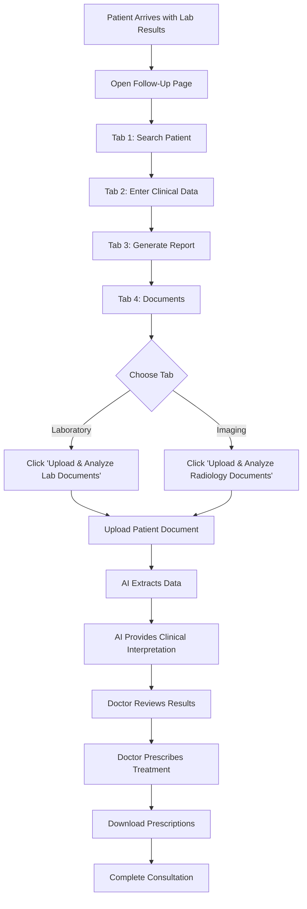

# 📋 Medical Documents Analysis - Access Guide

## 🎯 Where to Find Lab & Radiology Document Analysis

Medical documents analysis (biology tests and radiology reports) can be accessed from **TWO locations** in the application:

---

## 1️⃣ **From Consultation Hub** (Direct Access)

### Path
```
Consultation Hub → Medical Documents Analysis button
```

### Steps
1. Navigate to `/consultation-hub`
2. Look for the button: **"Medical Documents Analysis"** with 🔍 icon
3. Click to go directly to `/medical-documents`
4. Choose document type (Biology or Radiology)
5. Upload and analyze

### Use Case
- Quick document analysis outside of patient workflow
- Analyzing documents before patient consultation
- Standalone document review

---

## 2️⃣ **From Patient Follow-Up Pages** (Integrated Workflow) ⭐ **RECOMMENDED**

### Paths
The medical documents analysis is integrated into **ALL follow-up workflows**:

- `/follow-up/normal` - Normal consultation follow-up
- `/follow-up/dermatology` - Dermatology consultation follow-up  
- `/follow-up/chronic` - Chronic disease management follow-up

### Steps
1. Open any patient follow-up page
2. **Tab 1**: Search patient
3. **Tab 2**: Enter clinical data
4. **Tab 3**: Generate report
5. **Tab 4: Documents** ← **THIS IS WHERE YOU FIND IT**
   
   In Tab 4, you will see:
   
   #### 🧪 Laboratory Tab
   - **Blue section at the top**: "Analyze Patient Lab Results with AI"
   - **Button**: "Upload & Analyze Lab Documents"
   - Click to upload biology test documents
   
   #### 🔬 Imaging Tab
   - **Purple section at the top**: "Analyze Patient Radiology Reports with AI"
   - **Button**: "Upload & Analyze Radiology Documents"
   - Click to upload radiology reports

### Use Case - Real Workflow Example

**Scenario**: Patient comes for follow-up consultation with new lab results

1. **Tab 1 - Search Patient**: Find patient "John Doe" in system
   - System loads patient history automatically
   
2. **Tab 2 - Clinical Data**: Enter today's vitals and symptoms
   - Blood Pressure: 130/85
   - Symptoms: Fatigue, weight gain
   
3. **Tab 3 - Generate Report**: AI creates follow-up report
   - Compares with previous consultation
   - Generates recommendations
   
4. **Tab 4 - Documents**: 
   - **Click "Laboratory" sub-tab**
   - See blue section: "Analyze Patient Lab Results with AI"
   - **Click "Upload & Analyze Lab Documents"**
   - Upload patient's latest thyroid test results (PDF/image)
   - AI extracts: TSH, T3, T4 values
   - AI provides interpretation: "Subclinical hypothyroidism detected"
   - Doctor reviews AI analysis
   - Doctor prescribes medications in same tab
   - Doctor downloads prescription + lab orders

### Benefits of Integrated Approach
✅ **All patient data in one place** - No switching between pages
✅ **Context-aware** - Doctor has patient history already loaded
✅ **Efficient workflow** - Analyze → Interpret → Prescribe in one session
✅ **Complete documentation** - Everything saved to patient record

---

## 🔍 What Documents Can Be Analyzed?

### Biology Tests (13 Types)
- Complete Blood Count (CBC)
- Lipid Profile
- Liver Function Tests
- Kidney Function Tests
- Thyroid Function
- Diabetes Tests (HbA1c, Fasting glucose)
- Electrolytes
- Coagulation Tests
- Inflammatory Markers (CRP, ESR)
- Tumor Markers
- Hormone Tests
- Vitamin Levels
- Other biology tests

### Radiology Reports (6 Types)
- X-Ray
- CT Scan (TDM)
- MRI
- Ultrasound
- Mammography
- Other medical imaging

---

## 🤖 AI Analysis Features

### 1. OCR Extraction (GPT-4o-mini Vision)
- Automatically reads document text
- Extracts all test values and results
- Identifies normal/abnormal ranges
- Captures lab reference values

### 2. Medical Interpretation (GPT-4o)
- Clinical significance assessment
- Abnormality detection and explanation
- Recommendations for follow-up
- Critical alerts for urgent values
- Mauritian healthcare context

### 3. English Language
- All interface and analysis in English
- Adapted for Mauritius medical practice
- Follows local healthcare standards

---

## 📊 Complete Workflow Example



---

## 🎓 Training Tips for Doctors

### First Time Users
1. **Practice with sample documents first**
   - Use test lab reports to understand AI output
   - Familiarize yourself with the 4-step workflow
   
2. **Understand AI limitations**
   - AI provides suggestions, not final diagnosis
   - Always verify critical values manually
   - Use clinical judgment to override AI when needed

3. **Integrate into existing workflow**
   - Use during patient consultations
   - Have patient bring physical or digital copies
   - Save time on manual data entry

### Best Practices
✅ **High-quality images** - Clear, well-lit photos of documents
✅ **Complete documents** - Upload full report pages
✅ **Verify AI extraction** - Double-check critical values
✅ **Document everything** - Save results to patient record
✅ **Follow-up appropriately** - Act on critical alerts immediately

---

## 🆘 Support

If you have questions or issues:
- Check PR #68 for technical documentation
- Contact development team: @stefbach
- See `/medical-documents/README.md` for detailed module documentation

---

**Last Updated**: November 19, 2025  
**Version**: 1.0  
**Status**: Production Ready ✅
